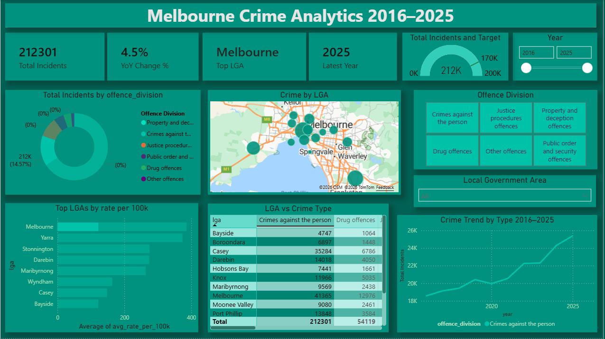

# Melbourne Crime Analytics Dashboard

## What this project does
Analyses 10 years of real Victorian government crime data to identify
which Melbourne suburbs have the highest crime rates, what types of crime
are changing, and how each council area has improved over time.

## Key Findings
- Melbourne CBD had the highest crime in 2025 with 34,386 incidents
- Knox improved the most incidents fell by 1,166 since 2016
- Wyndham grew the most up 6,452 incidents (fastest growing suburb)
- Crime dropped sharply in 2021 during COVID lockdowns then rebounded
- Property crime accounts for 71% of all offences in metro Melbourne

## Tech Stack
- Python (pandas, psycopg2) — data cleaning and loading
- PostgreSQL — structured storage with LAG() window function view
- Power BI — interactive dashboard with suburb/LGA/offence slicers

## How to Run

### 1. Install packages
pip install -r requirements.txt

### 2. Set up PostgreSQL
Create a database called melbourne_crime
Copy .env.example to .env and add your credentials

### 3. Download the data
Go to crimestatistics.vic.gov.au → Download Data
Save the Excel file to data\raw\crime_data.xlsx

### 4. Run the pipeline
python clean.py
python load.py
(run schema.sql in pgAdmin)
python analyse.py

### 5. Open the dashboard
Open powerbi\MelbourneCrime.pbix in Power BI Desktop

## Data Source
Crime Statistics Agency Victoria — Open Government Licence
crimestatistics.vic.gov.au
